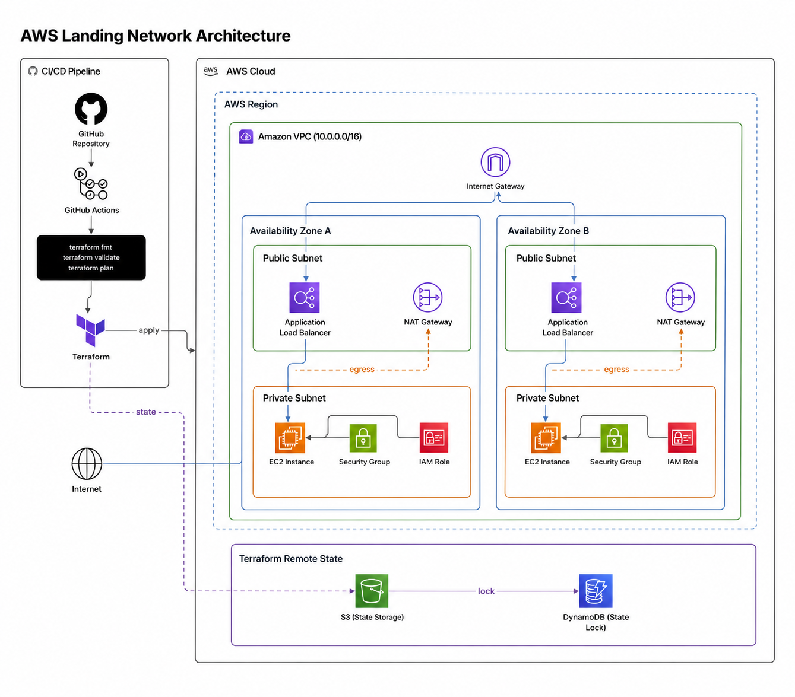
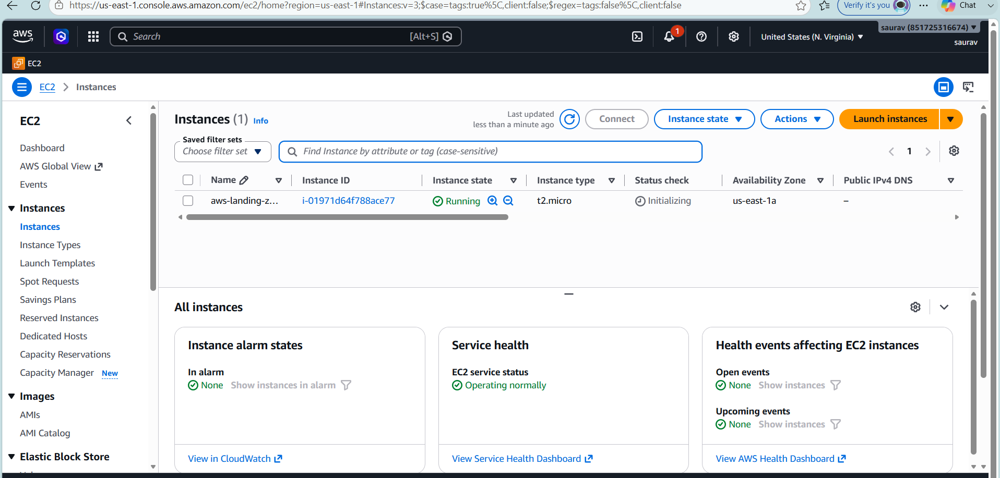
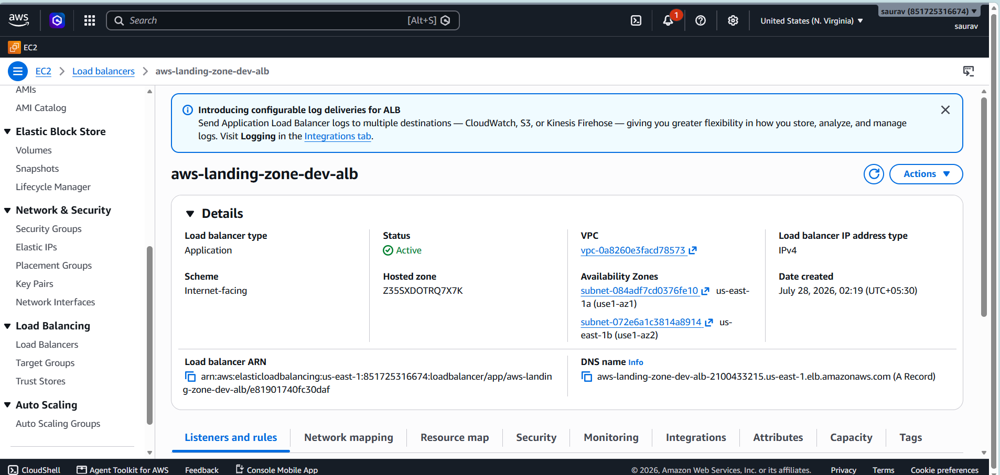
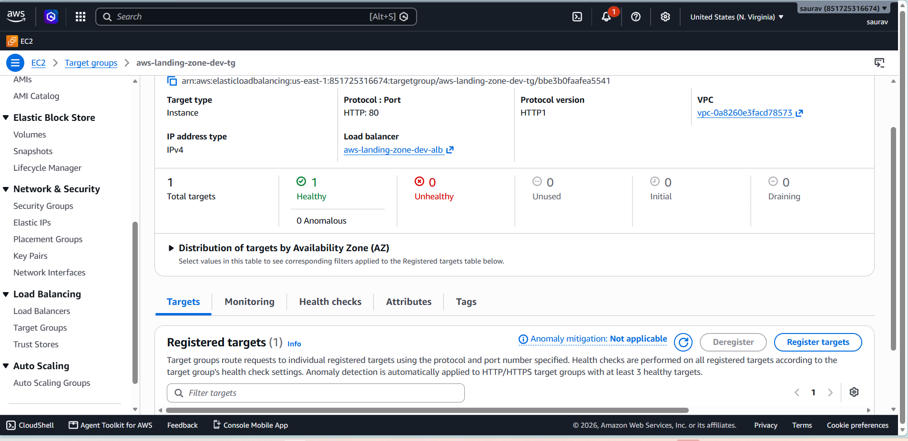

# AWS Landing Network — Terraform Infrastructure Project

A multi-AZ AWS network built entirely with Terraform: a VPC with public/private subnets, an Application Load Balancer routing traffic to EC2 instances in private subnets, a NAT Gateway for outbound-only internet access, scoped IAM roles, and a remote Terraform state backend with locking — all deployable through a GitHub Actions pipeline.

This project was built to practice real-world AWS networking and security patterns (not just spinning up a single EC2 instance), and to get hands-on with Terraform remote state, IAM least-privilege, and CI-driven infra validation.

## Architecture



**How it works:**
- A single VPC (`10.0.0.0/16`) spans two Availability Zones for high availability.
- Each AZ has a **public subnet** (Application Load Balancer + NAT Gateway) and a **private subnet** (EC2 instance, Security Group, IAM Role).
- The **Internet Gateway** allows inbound traffic only to the public subnets; EC2 instances in the private subnets have no direct internet exposure.
- The **NAT Gateway** gives private subnet resources outbound-only internet access (e.g., for package updates), with all egress traffic routed through it.
- **Security Groups** on the EC2 instances allow traffic only from the ALB — nothing else can reach the instances directly.
- **IAM Roles** attached to EC2 are scoped to what the instance actually needs, instead of using broad managed admin policies.
- **Terraform remote state** is stored in an S3 bucket, with a DynamoDB table handling state locking so the state can't be corrupted by concurrent applies.
- A **GitHub Actions** pipeline runs `terraform fmt`, `terraform validate`, and `terraform plan` on every pull request, before anything is applied.

## Tech Stack

| Category | Tools |
|---|---|
| Cloud Provider | AWS (VPC, EC2, ALB, Target Groups, IAM, S3, DynamoDB, NAT Gateway) |
| Infrastructure as Code | Terraform (remote state, modules, plan/apply workflow) |
| CI/CD | GitHub Actions |
| Networking | Multi-AZ VPC, public/private subnet segregation, NAT Gateway |
| Security | Scoped IAM instance roles, Security Groups restricting ALB-only ingress |

## Repository Structure

```
aws-terraform-landing-zone-project/
├── modules/
│   ├── vpc/              # VPC, subnets, route tables, IGW
│   ├── nat-gateway/      # NAT Gateway + EIP per AZ
│   ├── alb/              # Application Load Balancer + Target Group
│   ├── ec2/              # EC2 instances, Security Groups, IAM roles
│   └── backend/          # S3 + DynamoDB remote state resources
├── environments/
│   └── dev/              # Root module wiring the above together
├── .github/
│   └── workflows/
│       └── terraform.yml # fmt / validate / plan on PR
├── images/                # Architecture diagram + deployment screenshots
└── README.md
```
> Adjust this tree to match your actual folder layout before committing.

## Deployment Proof

Screenshots from the actual AWS Console after running `terraform apply`, confirming the infrastructure was provisioned as designed:

**Subnets — public and private subnets created across 2 Availability Zones**


**EC2 Instance — running in a private subnet**


**Application Load Balancer — active and internet-facing**


**ALB Details — VPC, availability zones, and DNS name**


**Target Group Health Check — EC2 instance registered and healthy behind the ALB**


## How to Deploy

```bash
# Clone the repo
git clone https://github.com/aniket-devop/aws-terraform-landing-zone-project.git
cd aws-terraform-landing-zone-project

# Initialize (pulls remote state config from S3 + DynamoDB)
terraform init

# Review the plan
terraform plan

# Apply
terraform apply
```

> Requires AWS CLI configured with credentials that have permissions for VPC, EC2, ELB, IAM, S3, and DynamoDB.

## CI/CD Pipeline

Every pull request triggers a GitHub Actions workflow that runs:
1. `terraform fmt -check` — enforces consistent formatting
2. `terraform validate` — catches syntax/config errors
3. `terraform plan` — shows exactly what would change, before merging

This catches broken or misconfigured infrastructure code before it ever reaches `apply`.

## Key Design Decisions

- **Private subnets for compute**: EC2 instances are never placed in public subnets — all inbound traffic must pass through the ALB.
- **NAT Gateway per AZ**: avoids a single point of failure for outbound traffic if one AZ has issues.
- **Remote state with locking**: prevents two people (or two pipeline runs) from applying at the same time and corrupting state.
- **Least-privilege IAM**: instance roles are scoped to specific actions instead of attaching AWS-managed admin policies.

## Future Improvements

- Add HTTPS listener on the ALB with an ACM certificate
- Add Auto Scaling Group instead of a static EC2 instance
- Add CloudWatch alarms and a basic monitoring dashboard
- Parameterize environments (dev/staging/prod) using Terraform workspaces or separate `.tfvars`

## Author

**Aniket Kumar**
DevOps Engineer | Terraform · Azure · AWS · Docker · Kubernetes · GitHub Actions
[GitHub](https://github.com/aniket-devop) · [LinkedIn](#)