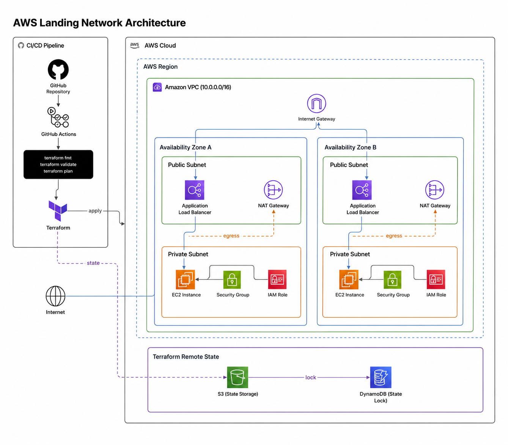
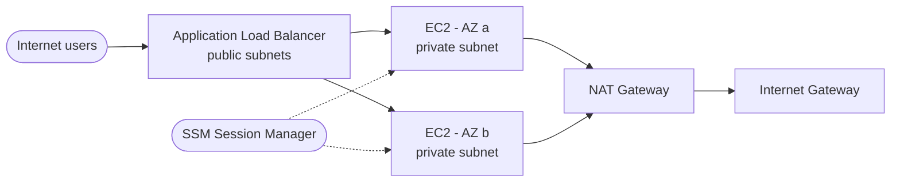
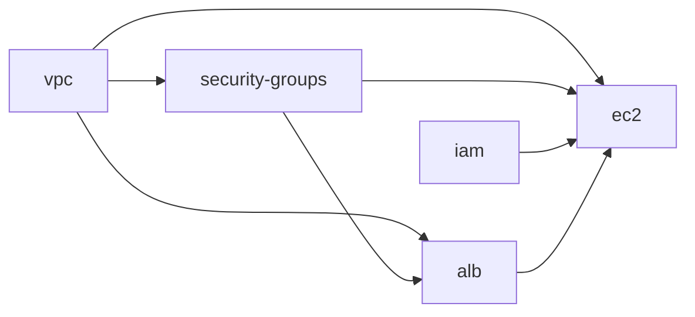
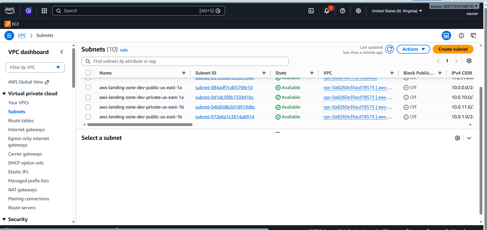
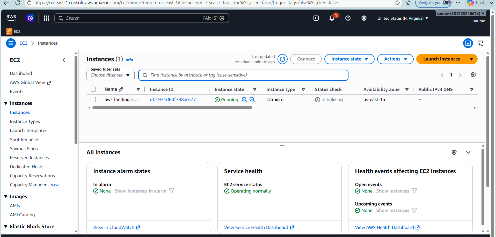
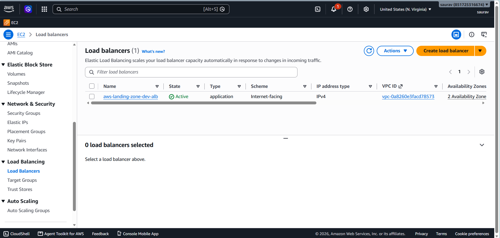
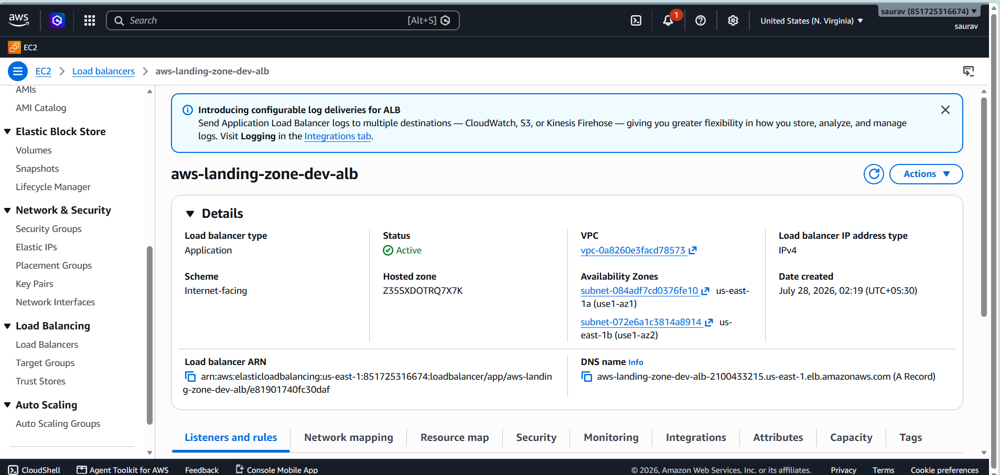
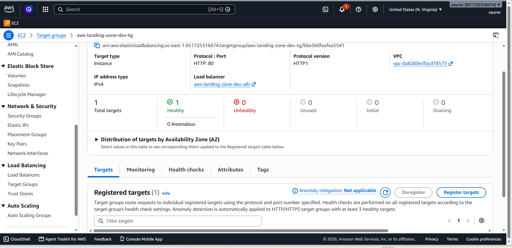
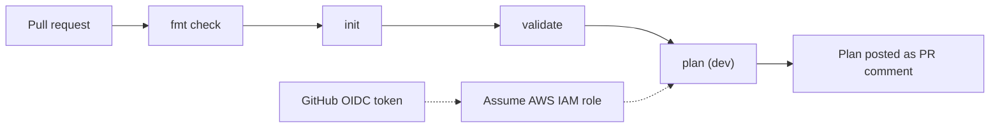

<div align="center">

# ☁️ AWS Terraform Landing Zone

**A production-style, multi-AZ AWS network built entirely with Terraform.**
Private compute behind an Application Load Balancer, SSH-free access, remote state with locking, and a CI pipeline that talks to AWS through OIDC.

[](https://github.com/aniket-devop/aws-terraform-landing-zone-project/actions/workflows/terraform-ci.yml)


[Architecture](#architecture) · [Highlights](#highlights) · [Quick Start](#quick-start) · [Security](#security-highlights) · [CI/CD](#cicd-pipeline) · [Screenshots](#deployment-proof)

<br>



<br>

| 🌍 **2** | 🧩 **5** | 🚀 **2** | 🔒 **0** | 🔑 **0** |
|:---:|:---:|:---:|:---:|:---:|
| Availability Zones | Reusable modules | Environments (dev, prod) | Open SSH ports | Long-lived AWS keys in CI |

</div>

## Highlights

- 🧱 **Modular Terraform:** five reusable modules (`vpc`, `security-groups`, `iam`, `alb`, `ec2`) composed by one root configuration.
- 🛡️ **Private by default:** EC2 instances sit in private subnets with no public IP. The ALB is the only entry point.
- 🚫 **No SSH, anywhere:** access goes through AWS SSM Session Manager. No inbound SSH rule, no key pair to distribute.
- 🔐 **Least-privilege IAM:** the instance role has only the SSM core policy plus a CloudWatch Logs policy scoped to one log-group prefix.
- 🗄️ **Remote state done properly:** S3 (versioned, encrypted, public access blocked) with DynamoDB locking, created by a separate bootstrap config.
- 🤖 **Keyless CI:** GitHub Actions runs `fmt`, `validate` and `plan` on every pull request using OIDC instead of stored AWS access keys.
- 🎛️ **One codebase, two environments:** dev and prod differ only in `.tfvars` (NAT topology, instance size and count).

> [!NOTE]
> This is a personal, sandbox-scale project. It is **not** an enterprise landing zone in the AWS Control Tower sense: there is no AWS Organizations setup, no Service Control Policies and no multi-account governance. The compute tier runs a demo Apache page, not a real application.

## Architecture


```mermaid
flowchart LR
    U([Internet users]) --> ALB["Application Load Balancer<br/>public subnets"]
    ALB --> A["EC2 - AZ a<br/>private subnet"]
    ALB --> B["EC2 - AZ b<br/>private subnet"]
    A --> NAT["NAT Gateway"]
    B --> NAT
    NAT --> IGW["Internet Gateway"]
    SSM(["SSM Session Manager"]) -.-> A
    SSM -.-> B
```

- A single VPC (`10.0.0.0/16`) spans two Availability Zones. Each AZ has a **public subnet** (ALB, NAT Gateway) and a **private subnet** (EC2).
- The **Internet Gateway** serves only the public subnets. Instances are never directly exposed to the internet.
- The **NAT Gateway** gives private subnets outbound-only access (patching, package installs, SSM). Topology is configurable: one shared NAT in dev (cost saver) or one per AZ in prod (no single point of failure).
- The **EC2 Security Group** accepts app traffic only from the ALB's Security Group.
- Instances (Amazon Linux 2023, Apache httpd) are spread round-robin across private subnets and registered in the ALB target group. IMDSv2 is enforced and the root volume is encrypted.
- **Terraform state** lives in S3 with a DynamoDB table for locking, so concurrent applies cannot corrupt it.

### Module composition


```mermaid
flowchart LR
    vpc --> sg["security-groups"]
    vpc --> alb
    sg --> alb
    vpc --> ec2
    sg --> ec2
    iam --> ec2
    alb --> ec2
```

## Environments

| Setting | dev | prod |
|---|---|---|
| Instance type | `t2.micro` | `t3.small` |
| EC2 instances | 1 | 2 |
| NAT Gateways | 1 (shared) | 1 per AZ |
| Region | `us-east-1` | `us-east-1` |

Both use the same modules and differ only in `environments/*.tfvars`. With one instance, dev runs in a single AZ; prod spreads two instances across both. The diagram above shows the **prod** topology. The `environment` variable also accepts `staging`, but no `staging.tfvars` exists yet.

## Deployment Proof

Screenshots from the AWS Console after `terraform apply`, confirming the infrastructure was provisioned as designed.

<table>
  <tr>
    <td width="50%"><b>Subnets</b><br>Public and private subnets across 2 AZs<br></td>
    <td width="50%"><b>EC2 instance</b><br>Running in a private subnet<br></td>
  </tr>
  <tr>
    <td width="50%"><b>Application Load Balancer</b><br>Active and internet-facing<br></td>
    <td width="50%"><b>ALB details</b><br>VPC, availability zones and DNS name<br></td>
  </tr>
  <tr>
    <td colspan="2"><b>Target group health</b><br>EC2 instance registered and healthy behind the ALB<br></td>
  </tr>
</table>

## Quick Start

**Prerequisites:** Terraform `>= 1.6.0, < 2.0.0`, AWS CLI configured, and credentials with permissions for VPC, EC2, ELB, IAM, S3 and DynamoDB.

```bash
git clone https://github.com/aniket-devop/aws-terraform-landing-zone-project.git
cd aws-terraform-landing-zone-project

# 1. Bootstrap remote state (once, local state)
cd bootstrap && terraform init && terraform apply && cd ..

# 2. Uncomment the block in backend.tf, fill in the bucket/table names
#    from the bootstrap outputs, then migrate state
terraform init -migrate-state

# 3. Plan and apply an environment
terraform plan  -var-file=environments/dev.tfvars
terraform apply -var-file=environments/dev.tfvars

# 4. Verify
curl http://$(terraform output -raw alb_dns_name)
```

> [!WARNING]
> NAT Gateways and the ALB are billed per hour even when idle. In `us-east-1` that is roughly $32/month per NAT Gateway plus data processing, and about $16/month for the ALB (check current AWS pricing). Run `terraform destroy` after testing.

<details>
<summary><b>Deployment details: state keys, SSM access, cleanup</b></summary>

**Why a separate bootstrap?** Terraform cannot create the bucket it will use as its own backend in the same run, so `bootstrap/` creates the S3 bucket and DynamoDB table first, using local state.

**Use a separate state key per environment.** If dev and prod share one key, applying prod would plan to destroy dev. Override the key per environment:

```bash
terraform init -reconfigure -backend-config="key=aws-landing-zone/dev/terraform.tfstate"
terraform init -reconfigure -backend-config="key=aws-landing-zone/prod/terraform.tfstate"
```

**Verifying.** Targets can take a couple of minutes to become healthy. To open a shell on an instance (no SSH needed; requires the AWS CLI Session Manager plugin):

```bash
aws ssm start-session --target <instance-id>
```

**Cleanup.**

```bash
terraform destroy -var-file=environments/dev.tfvars
```

The state bucket in `bootstrap/` has `prevent_destroy = true` and versioning enabled, so removing it is a deliberate manual step.

</details>

<details>
<summary><b>Inputs and outputs</b></summary>

| Variable | Default | Description |
|---|---|---|
| `aws_region` | `us-east-1` | Deployment region |
| `project_name` | `aws-landing-zone` | Prefix for resource names and tags |
| `environment` | `dev` | `dev`, `staging` or `prod` |
| `owner` | `aniket-kumar` | Owner tag |
| `vpc_cidr` | `10.0.0.0/16` | VPC CIDR |
| `availability_zones` | `us-east-1a`, `us-east-1b` | Two AZs |
| `public_subnet_cidrs` | `10.0.0.0/24`, `10.0.1.0/24` | One per AZ |
| `private_subnet_cidrs` | `10.0.10.0/24`, `10.0.11.0/24` | One per AZ |
| `single_nat_gateway` | `false` | One shared NAT Gateway instead of one per AZ |
| `instance_type` | `t3.micro` | EC2 instance type |
| `ec2_instance_count` | `2` | Number of EC2 instances |
| `app_port` | `80` | Port for the target group and EC2 Security Group |
| `key_pair_name` | `null` | Optional key pair; leave null and use SSM Session Manager |
| `alb_ingress_cidrs` | `["0.0.0.0/0"]` | CIDRs allowed to reach the ALB |
| `health_check_path` | `/` | Target group health check path |

**Outputs:** `vpc_id`, `public_subnet_ids`, `private_subnet_ids`, `nat_gateway_ids`, `alb_dns_name`, `ec2_instance_ids`, `ec2_private_ips`

</details>

## Repository Structure

```
aws-terraform-landing-zone-project/
├── modules/
│   ├── vpc/                 # VPC, subnets, IGW, NAT Gateway(s), route tables
│   ├── security-groups/     # ALB SG (80/443) and EC2 SG (app port from ALB only)
│   ├── iam/                 # EC2 role, SSM + CloudWatch Logs policies, instance profile
│   ├── alb/                 # Internet-facing ALB, target group, HTTP listener
│   └── ec2/                 # Instances in private subnets + target group attachments
├── environments/            # dev.tfvars, prod.tfvars
├── bootstrap/               # One-time S3 + DynamoDB setup for remote state
├── diagrams/                # Architecture diagram
├── images/                  # AWS Console screenshots (deployment proof)
├── .github/workflows/       # terraform-ci.yml (fmt / init / validate / plan)
├── backend.tf               # S3 backend (enabled after bootstrap)
├── main.tf                  # Composes the modules
├── variables.tf · outputs.tf · providers.tf · versions.tf
└── README.md
```

## Security Highlights

| Area | What is in place |
|---|---|
| **Instance access** | No public IP, no SSH ingress; access through SSM Session Manager |
| **Network** | EC2 Security Group accepts traffic only from the ALB Security Group |
| **IAM** | `AmazonSSMManagedInstanceCore` plus an inline CloudWatch Logs policy scoped to one log-group prefix |
| **Instance hardening** | IMDSv2 enforced (`http_tokens = "required"`), encrypted root EBS volume, ALB drops invalid header fields |
| **State** | Versioned S3 bucket, AES256 encryption, all public access blocked, `prevent_destroy`, DynamoDB locking |
| **CI credentials** | GitHub OIDC role assumption, no long-lived access keys stored in GitHub |

## CI/CD Pipeline


```mermaid
flowchart LR
    A[Pull request] --> B["fmt check"] --> C["init"] --> D["validate"] --> E["plan (dev)"] --> F["Plan posted as PR comment"]
    G["GitHub OIDC token"] -.-> H["Assume AWS IAM role"] -.-> E
```

`.github/workflows/terraform-ci.yml` runs on pull requests to `main`, and on pushes to `main` that touch Terraform files. It runs `terraform fmt -check -recursive`, `terraform init -backend=false`, `terraform validate`, and `terraform plan -var-file=environments/dev.tfvars`, then posts the plan as a PR comment.

The plan runs with `-backend=false`, so it verifies that the configuration plans cleanly rather than diffing against deployed state. The pipeline never runs `apply`; apply is a deliberate manual step.

Required repository secrets: `AWS_ROLE_TO_ASSUME` (IAM role ARN assumed via OIDC) and `AWS_REGION`.

## Key Design Decisions

- **Private subnets for compute:** instances never sit in public subnets; all inbound traffic passes through the ALB.
- **Configurable NAT topology:** one NAT Gateway per AZ in prod for AZ-isolated egress, one shared NAT in dev to save cost.
- **SSM instead of SSH:** no open inbound port and no key pair to distribute.
- **Remote state with locking:** prevents two people (or two pipeline runs) from applying at once. Bootstrapped separately to avoid the backend chicken-and-egg problem.
- **Least-privilege IAM:** a managed policy for SSM plus a scoped inline policy, instead of broad admin policies.
- **One configuration, per-environment tfvars:** dev and prod cannot drift apart in design.

## Skills Demonstrated

`Terraform modules` · `AWS networking (VPC, routing, NAT, ALB)` · `IAM least privilege` · `SSM Session Manager` · `Remote state and locking` · `Environment parity with tfvars` · `CI for infrastructure with OIDC` · `Cost-aware design trade-offs`

## Known Limitations

- The ALB listener is **HTTP-only**. The ALB Security Group opens port 443, but there is no HTTPS listener yet.
- In dev, a single NAT Gateway and a single instance mean no AZ-level redundancy (by design, for cost).
- CI plan uses `-backend=false`, so it does not diff against real state, and `apply` is manual.
- The IAM role allows CloudWatch Logs delivery, but no log agent is installed on the instances yet.
- No `staging` environment file yet.

## Roadmap

- [ ] HTTPS listener with an ACM certificate, and HTTP-to-HTTPS redirect
- [ ] Auto Scaling Group instead of static instances
- [ ] CloudWatch agent, alarms and a basic dashboard
- [ ] `staging.tfvars` and separate per-environment state backends
- [ ] Gated `apply` automation with a manual approval environment

## Author

<div align="center">

**Aniket Kumar** · DevOps Engineer

[](https://github.com/aniket-devop)
[](https://linkedin.com/in/aniket484)

⭐ If you found this project useful, consider giving it a star.

</div>
